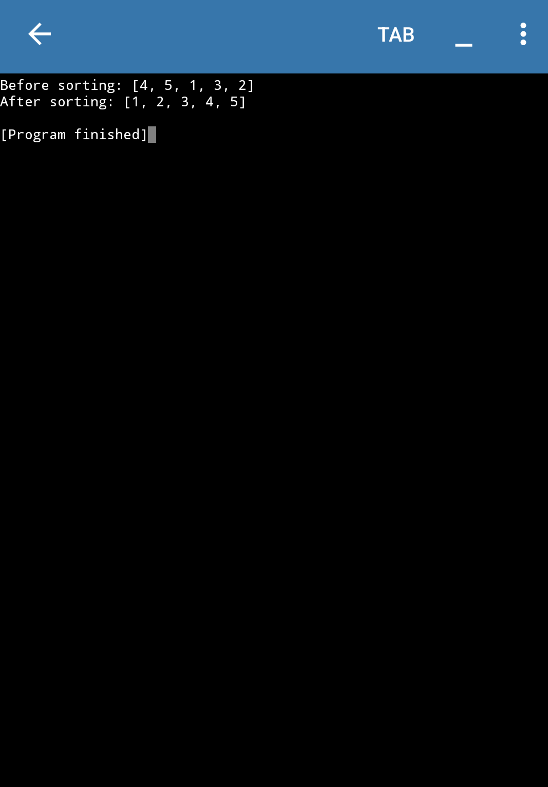

# Bubble Sort Algorithm 🧼🔁

This repository contains a simple and clean implementation of the **Bubble Sort algorithm** in Python.  
It also includes an optimized version that stops early if the list is already sorted.

---

## 📌 What is Bubble Sort?

Bubble Sort is a simple sorting algorithm that works by repeatedly swapping adjacent elements if they are in the wrong order.  
It’s called “bubble” sort because the largest elements "bubble up" to the top of the list with each pass.

---

## 💻 Code File

- `bubble_sort.py` – Contains the full Python implementation with sample input and output.

---

## 🚀 How to Run

### 📁 Prerequisites
- Python installed (version 3 or above)

### ▶️ Run the script
```bash
python bubble_sort.py

---

## 📸 Output Screenshot
✅✅
Here's the sample output of the optimized bubble sort program:



---

## 👩‍💻 Author

Made with 💙 by **Adiba Rahman**  
📧 adibarahmanwarsiii@gmail.com  
🌐 [My Portfolio](https://adibaarahman.github.io)  
🐱‍💻 [GitHub](https://github.com/AdibaaRahman)

---

## 📜 License

This project is open-source and free to use.  

